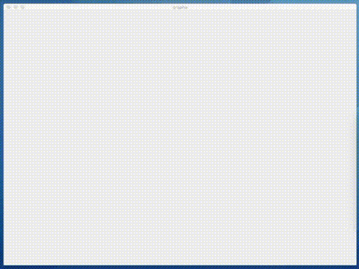
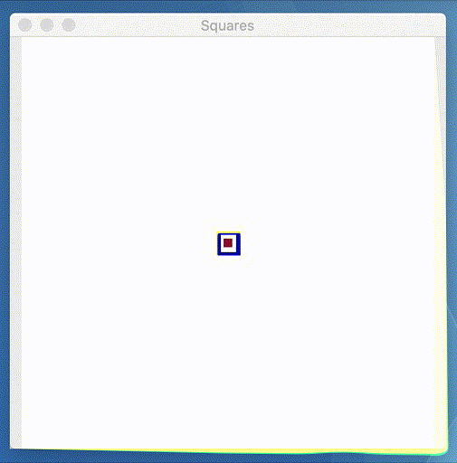

# PHEXT Visualise

[](https://php.net/) [](https://adoptopenjdk.net) [](license.txt) 

Visualise is a cross-platform *non-interactive* realtime graphics output display for PHP 8 over the command line SAPI.

Image frames can either be constructed with GD and passed to Visualise directly or produced or acquired via other means (e.g. from file or URL) by providing the pre-rendered image data as a string.

It uses the Java platform running under a sub-process that binds each window to the parent PHP script using the PCNTL extension.

## Install

Via Composer

``` bash
$ composer require sqonk/phext-visualise
```

### Requirements 

- PHP 8.0+
- PCNTL extension
- POSIX extension
- GD extension
- Java 8+ (Either OracleJDK or OpenJDK).

*You must have the full JDK installed, not just the JRE, which installs both java and javac (compiler) tools.*


API Reference
------------

Please see the [API Reference](docs/api/index.md) for full documentation of available methods.


## Philosophy

When attempting to build simple scripts or a proof of concept the inclination is to keep any output text-based and within the confines of the command line. While this avoids a lot of extra bulk and work necessary to make a program function with a graphical UI, it also restricts the type of information that can be displayed to the user (usually the developer writing the code).

Desktop graphical user interfaces typically come with event loops and other control frameworks that force that you structure your code to fit within their system.

Likewise Web apps, PHP's primary domain of usage, run over request-response cycles that spawn new running instances of a script with every run. 

Both scenarios add a necessary level of complication that adds to the development time.

Maybe you are trialing a proof-of-concept idea that you would like to get up and running quickly, or you have simple requirements for a command line script but would like graphical updates to be displayed on screen without having to vastly change your logic. Visualise can solve this problem by fitting in with your code instead of the other way round.

## Why Java?

Native PHP extensions have a nasty habit of breaking with nearly every major release of the language. For the various extensions that supported GUI bindings - as soon as the maintainers lost interest or otherwise moved on, compatibility was lost with successive revisions to the language.

By contrast user-land solutions have a better track record of weathering changes to the language and platform.

Java has been around since the 90s, widely used in enterprise and runs reliably on OS X, Linux and Windows. Further to that, the engine comes with [pre-packaged installers available for all three platforms](https://adoptopenjdk.net).

The Java side of Visualise requires no 3rd party Java libraries and makes use of tools that have been present in the language for most of its life, such as Swing UI.


## Examples

Run a series of graphs using [PlotLib](https://github.com/sqonk/phext-plotlib), 4 in total, and output all of them to 1 window, rending a new x-series value with each loop.

```php
require_once 'vendor/autoload.php';

use sqonk\phext\visualise\Visualiser;
use sqonk\phext\plotlib\BulkPlot;

$visualiser = new Visualiser;
$windowID = $visualiser->open(title:'graphs', width:1000, height:850, imageCount:4, posX:20, posY:25);

$values = [];
$xs = [];
foreach (sequence(start:1, end:100) as $i)
{
    $values[] = rand(1,30);
    $xs[] = $i;

    $plot = new BulkPlot;
    $plot->add(type:'line', series:[$values], options:[
        'title' => 'Lines',
        'xseries' => $xs,
    ]);
    $plot->add(type:'bar', series:[$values], options:[
        'title' => 'Bars',
        'xseries' => $xs,
    ]);
    $plot->add(type:'linefill', series:[$values], options:[
        'title' => 'Area',
        'xseries' => $xs,
    ]);
    $plot->add(type:'scatter', series:[$values], options:[
        'title' => 'Scatter Plot',
        'xseries' => $xs,
    ]);

    $images = $plot->render(writeToFile:false, width:500, height:400);
    $visualiser->update(images:$images, windowID:$windowID);
}
ask('press any key to continue.'); // pause script.
```




When utilising only a single window and a single image you also have the option using a generator to simplify your code even further.

This simple animation demonstrates the usage:

```php
require_once 'vendor/autoload.php';

use sqonk\phext\visualise\Visualiser;

$visualiser = new Visualiser;

function adjust($sq): void {
    $sq->size = $sq->dir ? $sq->size + $sq->step : $sq->size - $sq->step;
    if ($sq->size > 350)
        $sq->dir = false;
    else if ($sq->size < 5)
        $sq->dir = true;
}

$Sq = named_objectify('size', 'dir', 'step', 'r', 'g', 'b');
$squares = [ 
  $Sq(5, true, 10, 147,17,50),  
  $Sq(20, true, 5, 148,32,146), 
  $Sq(20, true, 15, 0,0,200)
];
foreach ($visualiser->animate(400, 400, title:'Squares', frames:1000, posX:20, posY:50) as $count => $img)
{
    # prefill white background
    $white = imagecolorallocate($img, 255,255,255);
    imagefilledrectangle(image:$img, x1:0, y1:0, x2:399, y2:399, color:$white);
    
    imagesetthickness($img, 3);
    foreach ($squares as $s) {
        $r = $s->size / 2;
        $clr = imagecolorallocate(image:$img, red:$s->r, green:$s->g, blue:$s->b);
        
        imagerectangle(image:$img, x1:200-$r, y1:200-$r, x2:200+$r, y2:200+$r, color:$clr);
        
        adjust($s);
    }   
}

println('completed.');
```




## Credits

Theo Howell


## License

The MIT License (MIT). Please see [License File](license.txt) for more information.